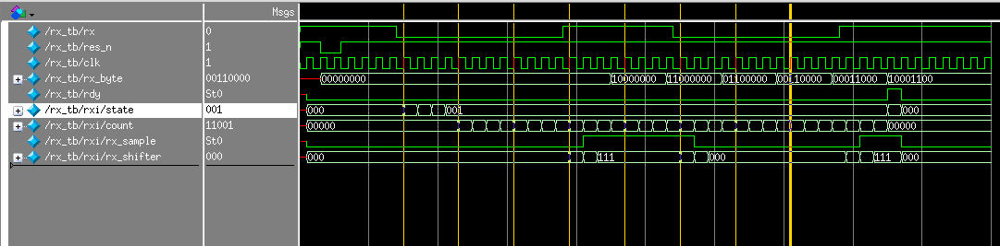

## _UART Receiver and Transmitter modules_

_Description: This project provides two modules rx and tx. They can be used to
interface your fpga with a uart._ 

For example, you may want to connect your FPGA to a max232 and communicate with
your computer via a DB9 serial cable. I myself use a little USB to TLL bridge
with a PL2303 chip. 

There are two modules with the following common:
 * The `clk` should be 4x your desired baud rate (used for oversampling)
 * There `res_n` signal is a active low asynchronous reset

#### RX Receiver
The receiver has the following timing diagram. 
 - The `rdy` signal will be high for one clock cycle after the `rx_byte` is ready.

#### TX Transmitter
The transmitter has the following timeing diagram. Note:
 - The `stb` strobe signal must be high for at least one `clk` edge. 

### Project Status/TODO
 * Compiles
 * Simulated
 * Confirmed in FPGA

### Project Setup
This project has been developed with quartus II. 

### License
BSD
